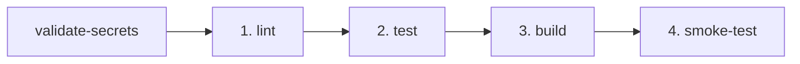

# 🚀 Módulo Backend de Gestión de Promociones

Backend REST API robusto, modular y altamente desacoplado desarrollado con **NestJS**, **TypeScript**, **TypeORM**, **Microsoft SQL Server**, **Arquitectura Hexagonal (Ports & Adapters)**, **Clean Code** y **Programación Reactiva (RxJS)**.

---

## 🏛️ 1. Arquitectura Hexagonal (Ports & Adapters)

El diseño de la aplicación divide de manera estricta el dominio de negocio de los detalles tecnológicos y de infraestructura, asegurando alta cohesión, bajo acoplamiento y testeabilidad completa:

```
src/
├── domain/                                     # 🔵 CAPA DE DOMINIO (Reglas de negocio puras, sin frameworks)
│   ├── entities/                               # Entidades del Dominio (Promocion, Producto, Categoria, PromocionRegla, etc.)
│   ├── exceptions/                             # Excepciones de Dominio (BusinessRuleValidationException, etc.)
│   ├── repositories/                           # Contratos / Interfaces de Repositorio del Dominio
│   └── value-objects/                          # Enums y Value Objects (EstadoPromocionEnum, TipoDescuentoEnum)
│
├── application/                                # 🟡 CAPA DE APLICACIÓN (Casos de uso y orquestación reactiva)
│   ├── dtos/                                   # Data Transfer Objects (class-validator & decoradores OpenAPI)
│   ├── mappers/                                # Data Mappers puros (Transformación Dominio <-> DTO)
│   ├── ports/
│   │   ├── input/                              # Puertos de Entrada (Interfaces para Casos de Uso)
│   │   │   ├── create-promocion.use-case.port.ts
│   │   │   ├── list-promociones.use-case.port.ts
│   │   │   ├── change-estado-promocion.use-case.port.ts
│   │   │   ├── delete-promocion.use-case.port.ts
│   │   │   ├── get-resumen-estados.use-case.port.ts
│   │   │   ├── get-resumen-vigentes.use-case.port.ts
│   │   │   ├── list-producto.use-case.port.ts
│   │   │   ├── list-categoria.use-case.port.ts
│   │   │   ├── list-tipo-descuento.use-case.port.ts
│   │   │   ├── list-estado-promocion.use-case.port.ts
│   │   │   ├── create-promocion-regla.use-case.port.ts
│   │   │   ├── create-promocion-categoria.use-case.port.ts
│   │   │   └── create-promocion-producto.use-case.port.ts
│   │   └── output/                             # Puertos de Salida (Interfaces para persistencia y adaptadores)
│   │       └── promocion.repository.port.ts
│   └── use-cases/                              # Implementación de Casos de Uso reactivos (RxJS Observables)
│       ├── create-promocion.use-case.ts
│       ├── list-promociones.use-case.ts
│       ├── change-estado-promocion.use-case.ts
│       ├── delete-promocion.use-case.ts
│       ├── get-resumen-estados.use-case.ts
│       ├── get-resumen-vigentes.use-case.ts
│       ├── list-producto.use-case.ts
│       ├── list-categoria.use-case.ts
│       ├── list-tipo-descuento.use-case.ts
│       ├── list-estado-promocion.use-case.ts
│       ├── create-promocion-regla.use-case.ts
│       ├── create-promocion-categoria.use-case.ts
│       └── create-promocion-producto.use-case.ts
│
└── infrastructure/                             # 🟢 CAPA DE INFRAESTRUCTURA (Frameworks, DB, HTTP, Swagger)
    ├── adapters/
    │   ├── in/                                 # Adaptadores Primarios / Driving (Controladores HTTP, Filters)
    │   │   └── http/
    │   │       ├── controllers/                # PromocionController, HealthController, ProductoController, etc.
    │   │       └── filters/                    # DomainExceptionFilter
    │   └── out/                                # Adaptadores Secundarios / Driven (Persistencia TypeORM)
    │       └── persistence/typeorm/repositories/
    │           ├── typeorm-promocion.adapter.ts
    │           ├── typeorm-producto.adapter.ts
    │           ├── typeorm-categoria.adapter.ts
    │           ├── typeorm-tipo-descuento.adapter.ts
    │           ├── typeorm-estado-promocion.adapter.ts
    │           ├── typeorm-promocion-regla.adapter.ts
    │           ├── typeorm-promocion-categoria.adapter.ts
    │           └── typeorm-promocion-producto.adapter.ts
    ├── config/                                 # Variables de entorno centralizadas
    └── persistence/typeorm/
        ├── entities/                           # Entidades ORM TypeORM mapeadas a tablas SQL Server
        └── mappers/                            # Entity Mappers (ORM <-> Dominio)
```

---

## 🎨 2. Patrones de Diseño Implementados

1. **Ports & Adapters (Hexagonal Architecture):** Aislamiento total de la lógica central respecto al framework HTTP y la base de datos a través de interfaces (`Input Ports` y `Output Ports`).
2. **Repository & Adapter Pattern:** Abstracción del almacenamiento de datos implementada mediante repositorios TypeORM que satisfacen puertos de salida.
3. **Data Mapper Pattern:** Mapeadores bidireccionales dedicados (`PromocionMapper`, `PromocionEntityMapper`, etc.) que garantizan que el dominio no contenga dependencias ORM ni DTOs.
4. **Data Transfer Object (DTO):** Validación rigurosa de entradas y tipado de salidas con `class-validator`, `class-transformer` y metadata Swagger.
5. **Factory Method:** Instanciación segura e invariantes validadas dentro del método estático `Promocion.create(...)`.
6. **Reactive Stream Pattern (RxJS):** Flujos no bloqueantes implementados con `Observable`, `map`, `switchMap` y `throwError`.
7. **Dependency Injection & Singleton:** Gestión de instancias y ciclo de vida orquestado por el contenedor IoC de NestJS.

---

## ⚖️ 3. Reglas de Negocio Implementadas

- ✅ **Campos Obligatorios:** No permite crear promociones sin nombre, sin producto/categoría asociada ni sin valor de descuento.
- ✅ **Rango de Fechas:** La `fecha_fin` debe ser estrictamente posterior a la `fecha_inicio`.
- ✅ **Descuento Porcentual:** Si el tipo de descuento es `Porcentaje` (ID: 1), el valor debe estar entre `1` y `100`.
- ✅ **Flujo de Estados Unidireccional:** Transición controlada: `Programada (1)` $\rightarrow$ `Activa (2)` $\rightarrow$ `Finalizada (3)`.
- ✅ **Inmutabilidad de Finalizadas:** Una promoción en estado `Finalizada` no puede modificarse bajo ninguna circunstancia.
- ✅ **Eliminación Segura:** Solo se pueden eliminar promociones en estado `Programada` (1).
- ✅ **Resumen de Vigencia:** Consulta que calcula y filtra promociones activas cuya vigencia cubre el día actual y se encuentran dentro del rango de fechas recibido (`fechaInicio` y `fechaFin`).
- ✅ **Resumen de Estados:** Conteo en tiempo real por estado: `Programada`, `Activa` y `Finalizada`.

---

## 🗄️ 4. Modelo de Datos (SQL Server)

Las tablas implementadas corresponden al esquema relacional de la prueba:
- `promociones`: Entidad principal con tipo de descuento, estado, vigencia y montos.
- `categorias`: Catálogo de categorías de productos.
- `productos`: Catálogo comercial de productos con precios y stock.
- `tipo_descuento`: Catálogo de tipos de descuento (`Porcentaje`, `Monto Fijo`).
- `estados_promocion`: Catálogo de estados (`Programada`, `Activa`, `Finalizada`).
- `promocion_productos`: Relación muchos a muchos entre promociones y productos.
- `promocion_categorias`: Relación muchos a muchos entre promociones y categorías.
- `promocion_reglas`: Reglas horarias, días de aplicación y límite por ticket.
- `ventas` y `detalle_ventas`: Registro y trazabilidad de ventas con promociones aplicadas.

---

## 🔐 5. Manejo Seguro de Secretos

- **Cero Credenciales en Código:** No existen credenciales ni contraseñas en el repositorio.
- **Configuración mediante `.env`:** Plantilla base documentada en `.env.example` con variables necesarias pero sin valores reales.
- **Inyección en CI/CD:** Las variables sensibles deben configurarse en **GitHub Secrets** (`DB_PASSWORD`, etc.) y son inyectadas como variables de entorno seguras en el runner.
- **Fallo Explícito:** El pipeline de CI/CD y los contenedores Docker están configurados para fallar explícitamente en caso de ausencia de variables requeridas.

---

## 🚀 6. Pasos de Instalación y Ejecución

### Opción A: Despliegue Completo con Docker Compose (Recomendado)

1. Clonar el repositorio y copiar el archivo de variables:
   ```bash
   cp .env.example .env
   ```
2. Iniciar todos los servicios (Base de datos SQL Server + API NestJS):
   ```bash
   docker-compose up -d --build
   ```
3. Verificar los servicios:
   - **API Base:** `http://localhost:3000/api/v1`
   - **Swagger UI:** `http://localhost:3000/api-docs`
   - **Health Check:** `http://localhost:3000/api/v1/health`

### Opción B: Ejecución Local en Desarrollo

1. Instalar dependencias:
   ```bash
   npm install
   ```
2. Configurar el archivo `.env` según tu tipo de autenticación:
   - **Autenticación Estándar de SQL Server:**
     ```env
     DB_HOST=localhost
     DB_PORT=1433
     DB_USER=sa
     DB_PASSWORD=mi_password_seguro
     DB_NAME=DBGestionPromociones
     ```
   - **Autenticación de Windows (NTLM / Integrada):**
     ```env
     DB_HOST=localhost
     DB_NAME=DBGestionPromociones
     DB_USE_WINDOWS_AUTH=true
     DB_DOMAIN=NOMBRE_EQUIPO_O_DOMINIO
     DB_USER=usuario_windows
     DB_PASSWORD=password_windows
     # Si utilizas una instancia con nombre (ej. SQLEXPRESS):
     DB_INSTANCE_NAME=SQLEXPRESS
     ```
3. Ejecutar en modo desarrollo:
   ```bash
   npm run start:dev
   ```
4. Ejecutar pruebas unitarias:
   ```bash
   npm test
   ```

---

## 🔄 7. Flujo CI/CD Automatizado con GitHub Actions

El proyecto incluye un pipeline automatizado en [.github/workflows/ci-cd.yml](.github/workflows/ci-cd.yml) compuesto por etapas dependientes (`validate-secrets` $\rightarrow$ `lint` $\rightarrow$ `test` $\rightarrow$ `build` $\rightarrow$ `smoke-test`):



1. **`validate-secrets`:** Valida de forma temprana y explícita la presencia de secretos obligatorios (`DB_PASSWORD`). Si falta alguna variable obligatoria, el pipeline falla de inmediato sin procesar etapas posteriores.
2. **`lint` (Linter):** Realiza la comprobación estática de tipos y calidad de código (`npm run lint`).
3. **`test` (Pruebas Unitarias):** Ejecuta la suite completa de pruebas unitarias en modo secuencial (`npm test -- --runInBand`).
4. **`build` (Construcción Docker):** Empaqueta y valida la imagen Docker del backend (`docker build`) verificando el build en dos etapas (builder $\rightarrow$ runner).
5. **`smoke-test` (Smoke Test de Integración con `/health`):**
   - Levanta el ambiente completo (`docker compose up -d --build`).
   - Espera a que SQL Server y el backend NestJS estén saludables.
   - Realiza polling HTTP al endpoint **`/health`**.
   - **Criterio de Aceptación:** Si `/health` no responde con código `200 OK` y estado `UP` / `database: connected`, el pipeline falla de inmediato y exporta los logs de los contenedores para diagnóstico.
   - Realiza teardown seguro (`docker compose down -v`).

---

## 📖 8. Documentación de Endpoints (Swagger / OpenAPI)

La interfaz interactiva de Swagger se encuentra disponible en: `http://localhost:3000/api-docs`

| Método | Endpoint | Tag Swagger | Descripción |
| :--- | :--- | :--- | :--- |
| `GET` | `/api/v1/health` | Health | Health Check (Verifica servicio y conexión a BD) |
| `GET` | `/api/v1/productos` | Productos | Listar catálogo de productos comerciales activos |
| `GET` | `/api/v1/categorias` | Categorías | Listar catálogo de categorías de productos activas |
| `GET` | `/api/v1/tipos-descuento` | Tipos de Descuento | Listar catálogo de tipos de descuento (Porcentaje, Monto Fijo) |
| `GET` | `/api/v1/estados-promocion` | Estados de Promoción | Listar catálogo de estados de promoción (Programada, Activa, Finalizada) |
| `POST` | `/api/v1/promociones` | Promociones | Crear una nueva promoción (con validaciones de negocio) |
| `GET` | `/api/v1/promociones` | Promociones | Listar todas las promociones con datos y relaciones |
| `PATCH` / `PUT` | `/api/v1/promociones/:id/estado` | Promociones | Cambiar estado (`Programada` $\rightarrow$ `Activa` $\rightarrow$ `Finalizada`) |
| `DELETE` | `/api/v1/promociones/:id` | Promociones | Eliminar promoción (Solo si está `Programada`) |
| `GET` | `/api/v1/promociones/resumen/conteo-estados` | Promociones | Contador simple por estado |
| `GET` | `/api/v1/promociones/resumen/vigentes` | Promociones | Consulta de promociones vigentes hoy por rango de fechas |
| `POST` | `/api/v1/promocion-productos` | Promoción Productos | Asociar un producto a una promoción existente |
| `POST` | `/api/v1/promocion-categorias` | Promoción Categorías | Asociar una categoría a una promoción existente |
| `POST` | `/api/v1/promocion-reglas` | Reglas de Promoción | Crear y asociar una regla a una promoción existente |

---

## 🧪 9. Pruebas Unitarias y Cobertura (Testing Strategy)

El proyecto cuenta con una exhaustiva suite de pruebas unitarias automatizadas con **Jest** y **ts-jest**, cubriendo todas las capas de la arquitectura hexagonal con aislamiento total mediante mocks:

### 🎯 Cobertura de Pruebas Unitarias

1. **Capa de Dominio (`src/domain`):**
   - Invariantes de creación y validación de promociones (`Promocion.create`).
   - Flujo de transiciones de estado: `Programada` $\rightarrow$ `Activa` $\rightarrow$ `Finalizada`.
   - Reglas de negocio: nombre obligatorio, productos/categorías asociados, descuento porcentual entre 1 y 100, fechas coherentes e inmutabilidad de promociones finalizadas.
   - Restricción de eliminación única para promociones en estado `Programada`.

2. **Capa de Aplicación (`src/application`):**
   - **Casos de Uso Reactivos (RxJS Observables):** `CreatePromocionUseCase`, `ListPromocionesUseCase`, `ChangeEstadoPromocionUseCase`, `DeletePromocionUseCase`, `GetResumenEstadosUseCase`, `GetResumenVigentesUseCase`, `ListProductoUseCase`, `ListCategoriaUseCase`, `ListTipoDescuentoUseCase`, `ListEstadoPromocionUseCase`, `CreatePromocionReglaUseCase`, `CreatePromocionCategoriaUseCase`, `CreatePromocionProductoUseCase`.
   - **Data Mappers:** `PromocionMapper`, `PromocionReglaMapper`, `PromocionCategoriaMapper`, `PromocionProductoMapper`, `CategoriaMapper`, `ProductoMapper`, `TipoDescuentoMapper`, `EstadoPromocionMapper`.

3. **Capa de Infraestructura (`src/infrastructure`):**
   - **Filtros de Excepciones:** `DomainExceptionFilter` (mapeo HTTP de `BusinessRuleValidationException` $\rightarrow$ 400, `PromotionNotFoundException` $\rightarrow$ 404, `InvalidPromotionStateException` $\rightarrow$ 422).
   - **Controladores HTTP:** `PromocionController`, `HealthController`, `ProductoController`, `CategoriaController`, `TipoDescuentoController`, `EstadoPromocionController`, `PromocionReglaController`, `PromocionCategoriaController`, `PromocionProductoController`.
   - **Entity Mappers:** `PromocionEntityMapper` (bidireccional ORM $\leftrightarrow$ Dominio).

### 🚀 Comandos de Testing

```bash
# Ejecutar todas las pruebas unitarias
npm test

# Ejecutar pruebas en modo observador (Watch Mode)
npm run test:watch

# Ejecutar pruebas con reporte de cobertura de código
npm run test:cov
```
